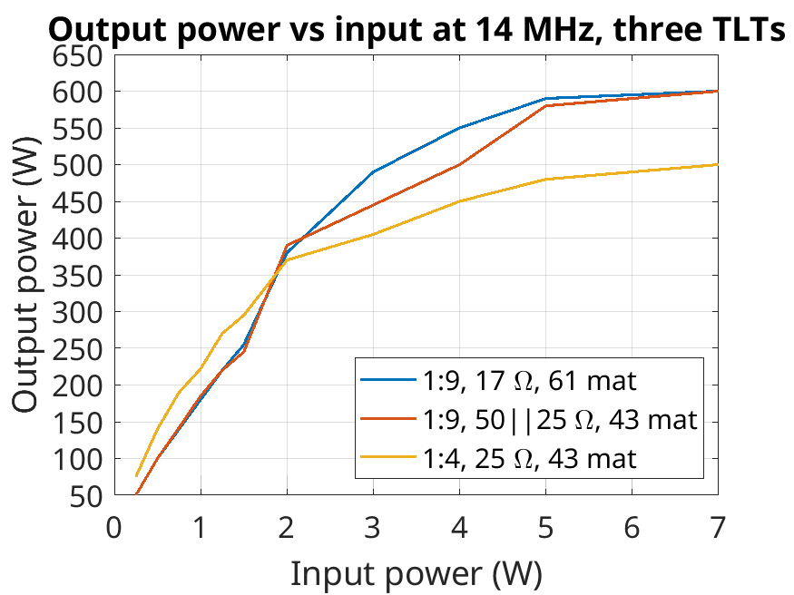
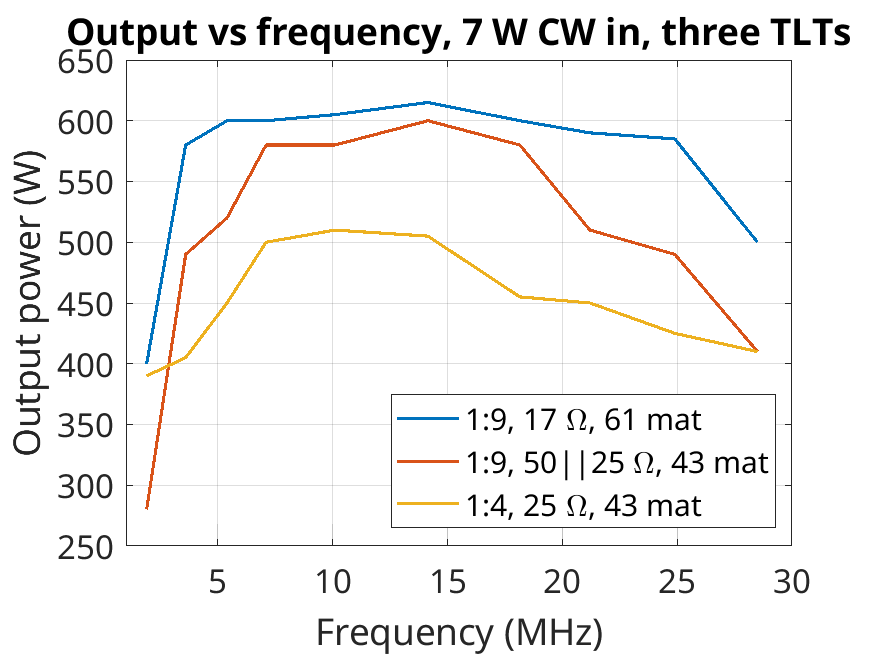

# Forte 600

This is a hardware repository for a 600 W linear RF amplifier working in the 1.8-30 MHz spectrum. I have performed extensive measurements of the output for different configurations of the output transmission line transformers (TLTs). Unfortunately, I don't have the equipment to test this amplifier above 30 MHz, but according to S11 measurements of the output, it should also cover the 6 m band with lower output power.

I recommend using a single 17 Ohm coaxial cable (HF141-17-FEP by Qaxial) for winding the TLTs. However, as shown in my tests, you can use a parallel combination of 50 and 25 Ohm cables, which are easier to find and less expensive. Such an improvised transformer will have worse Power Added Efficiency (PAE) and won't maintain peak power over the maximum wide bandwidth. The ferrite cores used are Fair-Rite 2661102002.

For more details, you can read my paper or full master thesis, which will be published on my webpage in the coming months: [https://www.sp6gk.com/]([https://www.sp6gk.com/](https://www.sp6gk.com/Forte_600W_Amplifier.html).

This project was inspired by Razvan Fatu's 600 W amplifier: [A 600W Broadband HF Amplifier Using Affordable LDMOS Devices](https://qrpblog.com/2019/10/a-600w-broadband-hf-amplifier-using-affordable-ldmos-devices/). The goal of this work was to perform measurements of return loss of the input and output matching network, characterize the linearity, power added efficiency (PAE), and most importantly, the impact of "improvised" TLTs over a "textbook" TLT.
